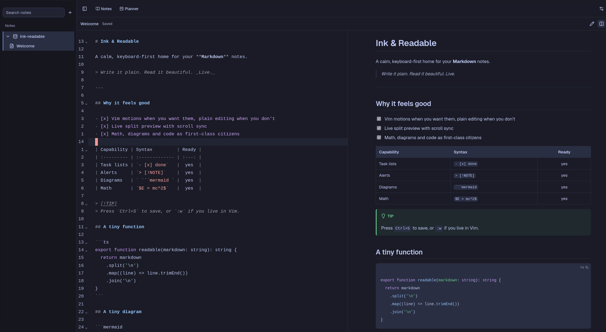

<h1 align="center">Ink &amp; Readable</h1>

<div align="center">
  
</div>

<p align="center">
  A calm, keyboard-first home for your Markdown notes.<br>
  Write it plain. Read it beautiful. <em>Live.</em>
</p>

---

## Features

- **Markdown notes, organized in vaults** with a collapsible file tree, create / rename / move / trash and restore.
- **Live split preview** — edit, split or preview-only, with scroll sync between panes.
- **Editor that stays out of the way** — CodeMirror 6, optional Vim motions, relative line numbers, autosave and format-on-save.
- **GitHub-flavored Markdown** — tables, task lists, strikethrough and GitHub alerts (`> [!NOTE]`, `[!TIP]`, `[!WARNING]`…).
- **Diagrams, math and code** — Mermaid diagrams, KaTeX math (`$…$`, `$$…$$`) and syntax-highlighted code blocks with a copy button and language label.
- **Planner** — projects and a drag-and-drop Kanban task board.
- **Multi-palette theming** — several color palettes with light and dark variants.

## Tech stack

| Layer    | Choices                                                                                                       |
| :------- | :------------------------------------------------------------------------------------------------------------ |
| Frontend | React 19, TypeScript, Vite, CodeMirror 6, Tailwind CSS 4, shadcn/ui, Vitest                                   |
| Backend  | Go, `net/http`, SQLite, [sqlc](https://sqlc.dev), [golang-migrate](https://github.com/golang-migrate/migrate) |
| Config   | HashiCorp Vault (external service) with a `.env` fallback for local development                               |
| Tooling  | Docker Compose, Make, Oxlint / Oxfmt                                                                          |

## Getting started

### Prerequisites

- Docker and Docker Compose
- Make
- A running Vault service, **or** `ENV=development` to read configuration from `backend/.env`

### Run the development stack

```bash
git clone https://github.com/AlvaroVFon/ink-readable.git
cd ink-readable
cp backend/.env.example backend/.env
make up-dev
```

This starts the API, applies migrations and runs the Vite dev server:

- Frontend: http://localhost:5173
- Backend: http://localhost:8082 (`GET /health`)

### Run the production stack

```bash
make up-prod
```

- Frontend: http://localhost:3000
- Backend: http://localhost:8082

## Development

### Backend

```bash
make build           # build the API binary
make run             # build and run locally
make test            # go test ./...
make migrate-up      # apply migrations
make migrate-version # current migration version
make db-reset        # migrate down -all + up
make sqlc-generate   # regenerate typed queries
```

The database lives at `backend/data/ink-readable.db` by default (override with `DB_PATH`).

### Frontend

```bash
cd frontend
pnpm install
pnpm dev
```

Checks:

```bash
pnpm lint
pnpm format:check
pnpm test
pnpm build
```

See [`frontend/README.md`](frontend/README.md) for the data-access layer and [`backend/README.md`](backend/README.md) for the API architecture.

## API

REST endpoints live under `/api/v1`:

- `vaults` — list, create, rename, delete
- `vaults/{vaultID}/documents` — list, create, rename paths
- `documents/{id}` — get, rename, move, update content, delete, restore, delete permanently
- `projects` and `tasks` — planner projects and Kanban tasks
- `editor/config` — persisted editor preferences (dark theme, Vim motion, format on save, relative line numbers)
- `config` — backend proxy that exposes the front-end secrets without leaking the Vault API key

## Project structure

```text
.
├── assets/              # Screenshots used in this README
├── backend/             # Go API: config, vaults, documents, projects, tasks, editor config
│   ├── cmd/             # entry point
│   ├── internal/        # domain, repositories, services, HTTP handlers
│   ├── migrations/      # versioned SQLite migrations
│   └── sqlc/            # SQL queries and generated code
├── frontend/            # React SPA (Vite, CodeMirror, Tailwind)
│   └── src/
│       ├── components/  # layout, theme and shadcn/ui primitives
│       ├── features/    # notes editor/preview and planner
│       ├── hooks/       # shared React hooks
│       └── lib/         # typed API client and schemas
├── docker-compose.yml       # production stack
├── docker-compose.dev.yml   # development stack
└── Makefile
```
